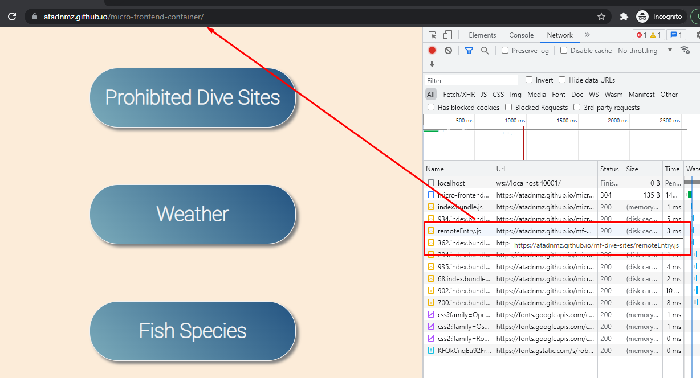

# Example for micro-frontend concept with React.js and Module Federation.

This example is a container of micro-frontends which loads different pages with using `github-pages`. Still under development. Only prohibited dive-sites is working for now. 
One of its sub-modules repository is `https://github.com/atadnmz/mf-dive-sites`. Entire pages are running on `gh-pages` seperately.

##Illustrations
 
 
 
 

## Important Files

Have a particular look at the following files:

- ``readme.md``: Shows how to install dependencies and how to start the example.
- ``micro-frontend-container\webpack.config.js``: Microfrontend config for development.
- ``micro-frontend-container\webpack.prod.js``: Microfrontend config for production.
- (gh-pages branch)``mf-dive-sites\remoteEntry.js``: In order to reach website from container.

## Installation and Usage

- Install packages: ``npm install`
- Start Micro Frontend (container): ``npm start``
- Start mf-dive-sites (sub-module): ``npm start``

## More Details on Module Federation

Have a look at this [Module Federation](https://webpack.js.org/concepts/module-federation/)

